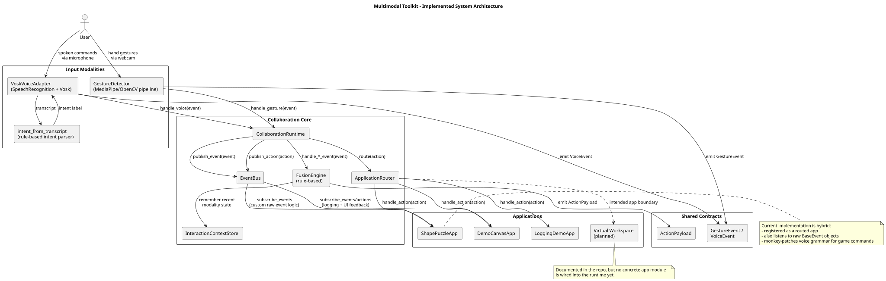
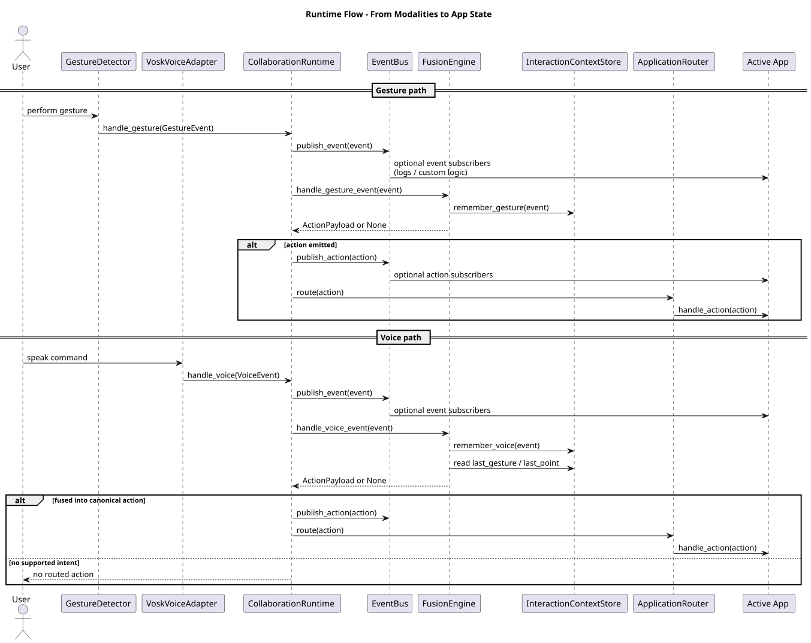
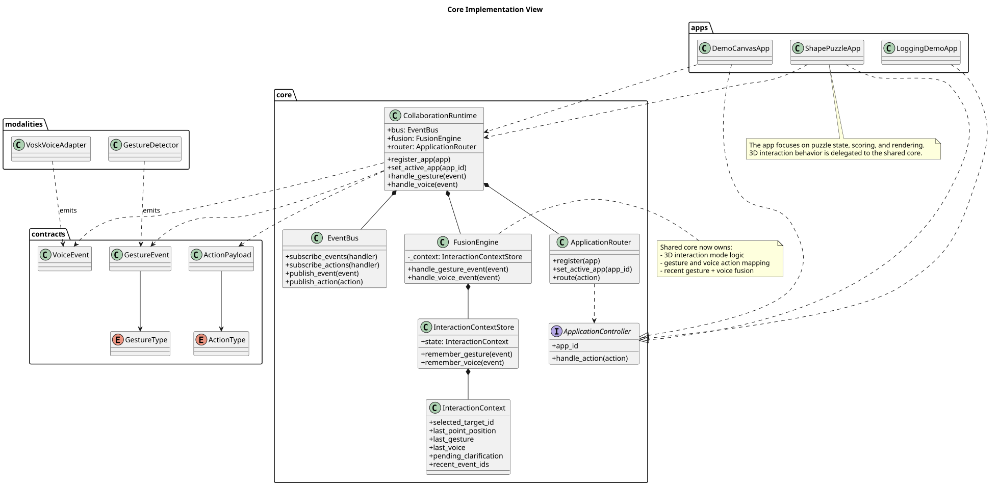

# Architecture

## Overview

This project is structured as a reusable multimodal interaction toolkit with
demonstration applications built on top of a shared core.

The architecture is local-first:

- speech recognition runs through a voice adapter
- hand tracking and gesture recognition run through a gesture adapter
- a collaboration core fuses both modalities into canonical actions
- demo applications consume those actions through a stable application API

This separation keeps modality logic, fusion logic, and app-specific logic
independent.

## Implemented Architecture Diagrams

The following diagrams were generated from the current repository structure and
runtime wiring.
They describe the implementation as it exists now.

### 1. System Architecture



Source: [`docs/diagrams/system-architecture.puml`](diagrams/system-architecture.puml)

### 2. Runtime Sequence



Source: [`docs/diagrams/runtime-sequence.puml`](diagrams/runtime-sequence.puml)

### 3. Core Implementation View



Source: [`docs/diagrams/core-implementation.puml`](diagrams/core-implementation.puml)

## Goals

- support object manipulation through voice and gesture
- reuse the same multimodal core across multiple apps
- keep the fusion engine understandable and easy to evaluate
- prefer open-source and locally runnable components where possible
- remain extensible for future modalities or additional demo apps

## High-Level Modules

### 1. Gesture Adapter

Responsibilities:

- camera input capture
- hand landmark tracking
- gesture recognition
- normalized pointer and hand pose estimation
- normalized gesture event emission

Input:

- webcam frames

Output:

- `GestureEvent`

### 2. Voice Adapter

Responsibilities:

- microphone input capture
- speech-to-text
- intent extraction
- configurable phrase-to-intent mapping
- normalized voice event emission

Input:

- microphone audio

Output:

- `VoiceEvent`

### 3. Collaboration Core

Responsibilities:

- receive modality events from adapters
- publish events and actions on an in-process `EventBus`
- track short-lived multimodal context in `InteractionContextStore`
- map gesture and voice input to canonical `ActionPayload` objects
- fuse recent voice and gesture input within a temporal window
- keep the 3D interaction and mapping logic in the shared core instead of in
  the shape puzzle app

Submodules:

- `runtime`
- `event_bus`
- `context_store`
- `fusion_engine`
- `application_router`
- `infra.config.fusion_config`

### 4. Application Layer

Responsibilities:

- define domain objects and scene state
- accept canonical actions from the core
- update the app state
- render the scene and feedback

Apps:

- `demo_app`
- `shape-puzzle`
- `shape-puzzle.mouse_keyboard_app`

## Data Flow

1. The gesture adapter emits gesture events.
2. The voice adapter emits voice events.
3. The runtime publishes raw events to the bus for optional observers.
4. The fusion engine evaluates events in a temporal window.
5. The fusion engine converts modality evidence into canonical actions.
6. The runtime publishes those actions and routes them to the active app.
7. The UI renders scene changes and system feedback.

## Canonical Contracts

### Gesture Event

```python
class GestureEvent(BaseEvent):
    source: Literal[ModalitySource.GESTURE]
    gesture: GestureType
    position: NormalizedPosition
    landmarks: Optional[list[NormalizedPosition]] = None
    hand: Optional[Literal["left", "right", "unknown"]] = None
```

### Voice Event

```python
class VoiceEvent(BaseEvent):
    source: Literal[ModalitySource.VOICE]
    transcript: str
    is_final: bool
    intent: Optional[str] = None
```

### Canonical Action

```python
class ActionPayload(BaseModel):
    type: ActionType
    target_id: Optional[str] = None
    delta: Optional[Delta] = None
    position: Optional[Position] = None
    scale: Optional[float] = None
    rotation: Optional[float] = None
    object_type: Optional[str] = None
    mode: Optional[str] = None
    metadata: dict[str, Any] = Field(default_factory=dict)
    source_events: list[str] = Field(default_factory=list)
```

## Fusion Strategy

The current implementation uses a rule-based fusion engine. The important
architectural point is that the 3D interaction logic used by the shape puzzle is
now handled in the shared core, not inside the puzzle app itself.

## Context Model

The context store should track:

- selected target id
- recent point position
- last gesture
- last voice event
- pending ambiguity or clarification state
- recent event ids

In the current implementation, the most important practical use is that a voice
command can reuse the most recent gesture-derived position.

## Error Handling

The system should degrade safely when inputs are uncertain or unsupported.

Examples:

- confidence thresholds can suppress low-quality voice or gesture events
- include and exclude config lists can disable unsupported commands
- unsupported voice intents simply produce no routed action
- apps remain responsible for domain-level feedback such as "no target in range"

## License and Deployment Implications

The repository license is AGPL-3.0.

Implications for architecture:

- prefer a local-first deployment for the main demo
- keep network services optional and replaceable
- if the system is exposed as a network service, corresponding source obligations apply to the deployed modified version

For the course project, a local desktop setup remains the clearest option.

## Suggested Milestones

1. Extend the action vocabulary only through shared contracts.
2. Keep app logic behind `handle_action()` boundaries.
3. Add new configs instead of hard-coding per-app voice vocabularies.
4. Add browser or network-facing artifacts as separate deployment targets.
5. Continue instrumentation and evaluation on top of the canonical action flow.
